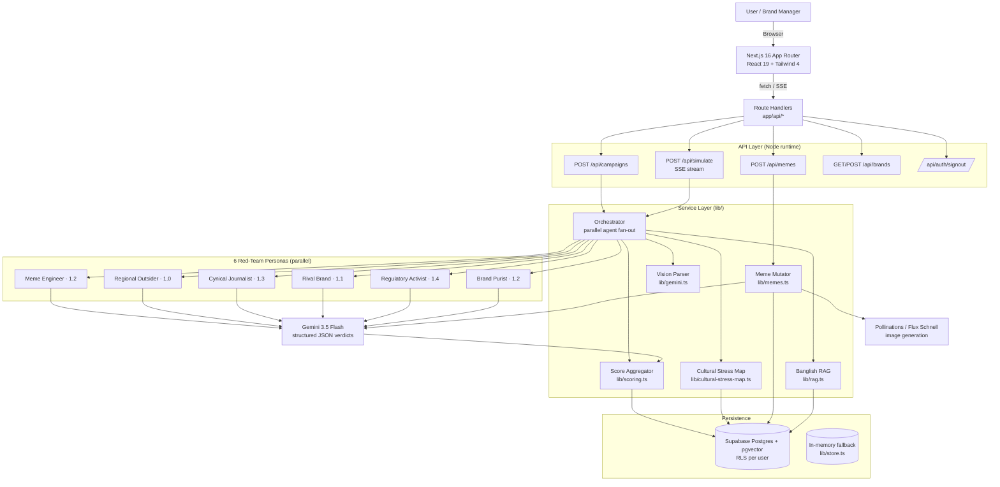
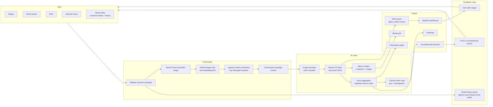

# Backfire OS

**Adversarial Brand Simulation Engine** — MarTech Track 2 for THE INFINITY AI BUILDFEST 2026.

Penetration testing for marketing campaigns in emerging markets. Upload a draft campaign and watch six AI red-team personas stress-test it against Bangladesh's cultural, linguistic, and regulatory landscape.

---

## 1. Product Overview

### What it does
Backfire OS is a pre-launch failure-prediction layer for brand campaigns. Where traditional MarTech predicts *success*, Backfire OS predicts *how a campaign will fail* — viral parody, regulatory action, regional backlash, rival hijacking, or brand-self-contradiction — *before* the campaign ships.

Each campaign is fanned out to six adversarial AI personas in parallel. Verdicts stream back over Server-Sent Events, are aggregated into six composite risk metrics, and are rendered as a "Backfire Dashboard" with mutated parody memes, a cultural stress heatmap, counterfactual branches, and a polarization graph.

### Target users
- **Brand managers & CMOs** at Bangladeshi consumer brands (FMCG, F-commerce, telco, fintech)
- **Agency creative directors** running pre-launch reviews on client work
- **Comms & PR teams** doing crisis pre-mortems
- **Regulators & ad-standards bodies** auditing campaigns under the Digital Commerce Guidelines / Essential Commodities Act 2025
- **Researchers** studying code-mixed (Banglish) sentiment and emerging-market culture-war dynamics

### Core use cases
1. **Pre-launch red-team review** — paste slogan + visual + brief, get 6 adversarial verdicts in ~30 s
2. **Brand-consistency audit** — verify a new campaign doesn't contradict the brand's prior public stance
3. **Regulatory pre-mortem** — surface Digital Commerce / Essential Commodities Act tripwires before legal sees them
4. **Meme-war wargaming** — generate the 4 most likely parody memes that the internet would make
5. **Counterfactual branching** — fork a campaign into "what if we changed the slogan / target / channel"
6. **Cultural stress mapping** — heatmap of geographic & demographic blast radius

---

## 2. Feature Matrix

Legend: ✅ live (in `main`) · 🟡 in progress · ⏳ planned · 🧪 experimental

| Category | Feature | Status | Notes |
|---|---|---|---|
| Core | Campaign upload (slogan + brief + values + image) | ✅ | `components/upload-form.tsx` |
| Core | 6-persona parallel red-team | ✅ | `lib/orchestrator.ts` |
| Core | SSE streaming verdicts | ✅ | `app/api/simulate/route.ts` |
| Core | Backfire Score Dashboard (6 metrics) | ✅ | `components/score-dashboard.tsx` |
| Core | Score radar visualization | ✅ | `components/score-radar.tsx` |
| Core | Meme Mutation Simulator (4 memes + Memeability) | ✅ | `lib/memes.ts` |
| Core | Bangla / English UI toggle | ✅ | `lib/i18n.ts` |
| RAG | BnSentMix Banglish RAG (pgvector) | ✅ | `lib/rag.ts`, fallback in `lib/bnsentmix-data.ts` |
| RAG | 20K-row BnSentMix seed pipeline | ✅ | `scripts/seed-bnsentmix.ts` |
| Vision | Multimodal campaign visual parsing | ✅ | Gemini 3.5 Flash |
| Brands | Brand entities (canonical values + history) | ✅ | `app/api/brands`, `supabase/migrate-brands.sql` |
| Brands | Brand Purist agent (consistency audit) | ✅ | `lib/agents/definitions.ts:150` |
| Maps | Cultural Stress Heatmap (geo + demographic) | ✅ | `components/cultural-heatmap.tsx`, `components/world-stress-map.tsx` |
| Auth | Supabase email/password auth + RLS | ✅ | `middleware.ts`, `supabase/migrate-auth.sql` |
| Persistence | Runs, verdicts, memes, brands persisted | ✅ | `lib/store.ts`, `lib/db/runs.ts` |
| Insights | Polarization graph | ✅ | `components/polarization-graph.tsx` |
| Insights | Counterfactual Branching ("Git for campaigns") — AI war-room scoring + persisted variant tree | ✅ | `components/counterfactual-branches.tsx`, `app/api/branch-score`, `app/api/branches`, `supabase/migrate-branches-tree.sql` |
| Insights | Run history with selection | ✅ | `app/history` |
| Workflow | Boardroom Mode (multi-agent live debate) | 🟡 | `app/boardroom` scaffold |
| Workflow | Regulatory Pre-Mortem Generator | 🟡 | `app/post-mortem` scaffold |
| Data | Firecrawl live-news headline ingestion | ⏳ | Roadmap §9 |
| AI | LoResLM fine-tune on full BnSentMix | ⏳ | Roadmap §9 |
| AI | GraphRAG over brand × campaign × backlash events | ⏳ | Roadmap §9 |
| Ops | Vercel deploy + env wiring | ✅ | `next.config.ts` |
| Ops | Demo mode (no API keys required) | ✅ | Mock verdicts + placeholder images |

---

## 3. Architecture Diagram



The diagram is rendered server-side by GitHub. Source it from a Mermaid live editor (https://mermaid.live) to edit.

---

## 4. Data Flow Diagram



---

## 5. Technology Stack

### Frontend
- **Framework:** Next.js 16.2.6 (App Router, React Server Components)
- **UI:** React 19.2, Tailwind CSS 4 (PostCSS), custom `components/ui/*`
- **State:** Server components + client islands; SSE for streaming verdicts
- **i18n:** Custom Bangla/English provider (`lib/i18n.ts`, `components/language-provider.tsx`)
- **Bundler:** Next.js / Turbopack

### Backend
- **Runtime:** Next.js Route Handlers on Node runtime (`maxDuration: 120s`)
- **Streaming:** native `ReadableStream` + `text/event-stream`
- **Validation:** Zod 4
- **Auth middleware:** `@supabase/ssr` cookie-based session refresh (`middleware.ts`)

### Database
- **Primary:** Supabase Postgres + `pgvector` (768-dim embeddings, IVFFlat index)
- **Schema:** `supabase/schema.sql` (+ migrations: `migrate-auth.sql`, `migrate-brands.sql`, `migrate-cultural-stress-map.sql`, `migrate-768.sql`, `migrate-delete-runs.sql`, `migrate-branches-tree.sql`, `migrate-branches-campaign.sql`, `migrate-branch-events.sql`)
- **RLS:** per-user row-level security (`supabase/migrate-auth.sql`)
- **Storage:** Supabase Storage bucket for campaign images
- **Branch tree:** `campaign_branches` adjacency list (`parent_id` self-ref, `ON DELETE CASCADE` for subtree prune), scoped per campaign via `campaign_id` — a real campaign's tree root is seeded from its copy + actual verdict; `campaign_id NULL` is the standalone demo tree — `lib/db/branches.ts`, `lib/branches/store.ts`
- **Commit history:** `branch_events` append-only log (fork / edit / prune / score / baseline), scoped per user+campaign, recorded on every mutation and reloaded with the tree — `lib/db/branch-events.ts`, `app/api/branch-events`
- **Fallback:** in-memory store (`lib/store.ts`, `lib/branches/store.ts`) when Supabase keys absent

### AI Stack
- **LLM:** Google Gemini 3.5 Flash via `@google/genai` and `@google/generative-ai`
- **Vision:** Gemini 3.5 Flash (multimodal — same model)
- **Embeddings:** Gemini `text-embedding-004` (768 dim)
- **Image generation:** Pollinations.ai (Flux) primary, Gemini image fallback
- **RAG corpus:** BnSentMix (~20K Banglish samples) — see `scripts/download-bnsentmix.ts`, `scripts/seed-bnsentmix.ts`

### Infrastructure
- **Hosting:** Vercel (preview + prod)
- **DB hosting:** Supabase
- **Image CDN:** Pollinations.ai
- **Package manager:** pnpm
- **TypeScript:** 5.x, strict

---

## 6. API Documentation

### Auth model
- Supabase email/password via `@supabase/ssr`. Session cookies refreshed in `middleware.ts`.
- Every API handler calls `resolveDbContext()` (`lib/supabase/persistence.ts`) which returns one of: `db` (authenticated, persisting), `unauthorized` (401), or `db_unconfigured` (503, demo).
- Postgres RLS scopes all rows by `user_id = auth.uid()`.

### APIs exposed

#### `POST /api/campaigns`
Create a campaign + initial run.

**Body:** `{ slogan, brandValues?, brief?, imageBase64?, brandId? }`
**Returns:** `{ campaignId, runId }`
**Errors:** `400` missing slogan, `400` invalid brandId, `401` unauthorized, `503` db unconfigured

#### `GET /api/campaigns?runId=<uuid>`
Fetch a single run (campaign, verdicts, memes, stress map, image).

#### `GET /api/campaigns?list=true`
List all runs for the authenticated user.

#### `POST /api/simulate`
Run the 6-agent simulation. Streams Server-Sent Events.

**Body:** `{ runId, imageBase64? }`
**Stream events:**
- `status` — progress messages
- `agent_start` — `{ agentId }` × 6
- `agent_verdict` — `{ agentId, agentName, severity, reasoning, sampleAttack, citationIds }`
- `stress_map` — geo + demographic stress payload
- `complete` — `{ verdicts, imageDescription, culturalStressMap }`
- `error` — `{ message }`

#### `POST /api/memes`
Generate 4 parody memes + Memeability scores. Body: `{ runId }`.

#### `GET /api/brands` · `POST /api/brands`
List / create brand entities (name, description, canonical stated values).

#### `GET/PATCH/DELETE /api/brands/[id]`
Inspect / update / delete a single brand.

#### `POST /api/auth/signout`
Clear Supabase session cookies.

### APIs consumed (outbound)
| Service | Used for | File |
|---|---|---|
| Google Gemini `gemini-3.5-flash` | Agent verdicts, vision, meme captions | `lib/gemini.ts` |
| Google Gemini `text-embedding-004` | RAG query + seed embeddings | `lib/rag.ts`, `scripts/seed-bnsentmix.ts` |
| Pollinations.ai (Flux) | Meme image generation | `lib/pollinations.ts` |
| Gemini image generation | Meme image fallback | `lib/meme-fallback.ts` |
| Hugging Face datasets | BnSentMix corpus download | `scripts/download-bnsentmix.ts` |
| Supabase REST + Realtime | Persistence, auth, RLS | `lib/supabase/*` |

---

## 7. Data Layer

### Data sources
- **BnSentMix** (`aplycaebous/BnSentMix` on Hugging Face) — ~20K labeled Banglish sentiment samples, the RAG corpus
- **Cultural stress map definitions** — `lib/cultural-stress-map.ts`, `lib/markets/*` (Dhaka, Sylhet, Chittagong, rural BD; demographic axes)
- **User-supplied campaign data** — slogan, brand values, brief, image (base64)
- **User-supplied brand entities** — canonical name, description, stated values, derived history of prior runs
- **Regulatory references** — Bangladesh Digital Commerce Guidelines, Essential Commodities Act 2025 (embedded in agent prompts, no external fetch yet)

### Scraping / parsing
- **BnSentMix ingestion:** `scripts/download-bnsentmix.ts` pulls parquet from HF Datasets and writes JSONL.
- **Seeding pipeline:** `scripts/seed-bnsentmix.ts` embeds rows with Gemini `text-embedding-004` and upserts into `bnsentmix_samples` (pgvector, IVFFlat, cosine). Resumable via `--resume`, batchable via `--limit`.
- **Image parsing:** uploaded images are sent base64 to Gemini Vision, which returns a structured natural-language description used in every agent prompt.

### Storage
- **Relational tables** (`supabase/schema.sql`):
  - `campaigns` — slogan, brand values, brief, image URL, image description
  - `simulation_runs` — status + 6 score columns
  - `agent_verdicts` — per-agent severity / reasoning / sample attack / citations
  - `memes` — caption, image URL, memeability score, fallback flag
  - `bnsentmix_samples` — `vector(768)` embeddings
  - `brands` + brand history (`migrate-brands.sql`)
  - `cultural_stress_maps` (`migrate-cultural-stress-map.sql`)
- **Object storage:** Supabase Storage bucket `campaign-images` (RLS-scoped)
- **Fallback:** when Supabase keys are unset, `lib/store.ts` keeps an in-memory map (per Node process, lost on reload)

### Privacy handling
- All tables are RLS-protected; users see only their own rows
- No PII is requested; campaign content is treated as user-owned IP
- Campaign images stored in user-scoped Storage paths
- Agent-generated parody memes are clearly labeled as synthetic and not for redistribution
- Demo mode never sends data to Supabase or third-party LLMs

---

## 8. AI Layer

### Models
| Role | Model | Provider |
|---|---|---|
| Agent reasoning (all 6 personas) | `gemini-3.5-flash` | Google AI |
| Vision (campaign image → description) | `gemini-3.5-flash` (multimodal) | Google AI |
| Embeddings | `text-embedding-004` (768 dim) | Google AI |
| Meme captions | `gemini-3.5-flash` | Google AI |
| Meme images (primary) | Flux Schnell via Pollinations | Pollinations.ai |
| Meme images (fallback) | Gemini image generation | Google AI |

### RAG
- **Corpus:** BnSentMix (~20K rows in `bnsentmix_samples`); fallback of 50 hand-curated rows in `lib/bnsentmix-data.ts`
- **Retrieval:** `match_bnsentmix(query_embedding, match_count=5)` SQL function — cosine distance on IVFFlat index (lists = 100)
- **Injection:** top-5 Banglish examples (text + sentiment label) are embedded in each adversarial agent prompt as `Reference Banglish sentiment examples:`
- **GraphRAG (planned):** brand × campaign × backlash-event graph — see roadmap

### Personalization logic
- Each user owns their **brands** and **runs** (RLS-scoped). The **Brand Purist** agent (`lib/agents/definitions.ts:150`) ingests:
  1. The brand's canonical stated values
  2. The brand's prior completed runs (most recent 10)

  …and audits the new campaign for tone drift, value reversal, or contradiction. This means the system *gets sharper as a brand accumulates history*.
- The 6-agent ensemble is **weighted** (Regulatory Activist 1.4, Cynical Journalist 1.3, Meme Engineer 1.2, Brand Purist 1.2, Rival Brand 1.1, Regional Outsider 1.0) so the Backfire Score reflects real-world severity asymmetry.

### Explainability
- Every agent returns structured JSON: `{ severity 0–100, reasoning (2–3 sentences), sample_attack, citation_ids[] }`
- `citation_ids` link back to `bnsentmix_samples.id` rows so users can audit which Banglish examples informed a verdict
- The Brand Purist quotes specific prior-campaign entries (`Contradicts [2]: previously claimed X, now claims Y`)
- Full reasoning chains are rendered in `components/agent-verdict-card.tsx` — no black-box scores
- Severity bands are documented inline in agent prompts (e.g. Brand Purist: 0–30 consistent, 31–60 mild drift, 61–85 clear contradiction, 86–100 total reversal)

---

## 9. Product Roadmap

### Short term (next 4 weeks — by 2026-06-24)
- Finish **Boardroom Mode** — multi-agent live debate with cross-examination turns (`app/boardroom`)
- Finish **Regulatory Pre-Mortem Generator** — structured legal/compliance report (`app/post-mortem`)
- Replace placeholder pages on `/heatmap`, `/branches`, `/post-mortem`, `/boardroom` with full UIs
- Add per-run shareable public URLs (with brand owner opt-in)
- Improve meme image quality (style controls, brand colors)

### Mid term (next 3 months — by 2026-08)
- **Firecrawl pipeline** — ingest live Bangladesh news + Reddit/Facebook posts to ground verdicts in real backlash events
- **GraphRAG** over brand × campaign × backlash-event graph for cross-brand learning
- **CSV / Figma plugin import** for campaign decks
- **Slack / Teams notifications** when a run crosses a severity threshold
- **Multi-brand workspaces** with role-based access (Owner / Editor / Viewer)
- Extend cultural stress map to **India, Pakistan, Indonesia, Nigeria**

### Long term (6–12 months — by 2027-Q2)
- **LoResLM fine-tune** on full BnSentMix corpus → on-prem inference for enterprise tenants
- **Agentic counterfactual generation** — Backfire OS proposes the safer slogan rewrite, not just flags risk
- **API / SDK** so agencies embed Backfire OS in their own creative tools
- **Audit-grade compliance reports** signed for regulatory submission
- Marketplace of community-contributed adversarial personas (verified)

---

## 10. Performance & Scalability

### Load expectations
- **MVP target:** 100 concurrent campaign authors, ~500 simulations/day
- **Cold-path latency:** ~25–35 s per run (6 agents in parallel + vision + 4 memes)
- **Warm SSE TTFB:** < 1 s (first `status` event)
- **DB working set:** ~20K BnSentMix vectors + ~10K runs/brand projected at year 1

### Optimization strategy
- **Parallel agent fan-out** via `Promise.all` in `lib/orchestrator.ts` — total latency = slowest agent, not sum
- **SSE streaming** so users see verdicts as they land, not after the full run completes
- **pgvector IVFFlat** (`lists = 100`) keeps top-5 RAG retrieval under 50 ms at 20K rows
- **Server components** keep JS bundle small; only client islands hydrate (upload form, dashboard, language toggle)
- **Image proxy / Next.js Image** for meme outputs to keep LCP low
- **Stateless route handlers** so Vercel can horizontally scale on demand (`maxDuration = 120s` on `/api/simulate`)
- **Demo mode short-circuit** so judges / first-time users don't burn LLM quota
- **Brand-history cap** at 10 most-recent runs to bound Brand Purist context size

### Known bottlenecks → mitigations
| Bottleneck | Mitigation |
|---|---|
| Gemini rate limits (free tier) | Per-user API key support (planned), exponential backoff (current) |
| Pollinations image latency | Gemini image fallback (`lib/meme-fallback.ts`) |
| pgvector cold IVFFlat index | Pre-warm via cron on Supabase |
| SSE connection drops on Vercel | Reconnect + idempotent run state (run is persisted before stream opens) |

---

## 11. Security

### Authentication
- Supabase email/password via `@supabase/ssr`
- Session cookies refreshed by Next.js middleware (`middleware.ts`) on every request
- Sign-out endpoint (`/api/auth/signout`) clears cookies server-side
- Email confirmation optional (toggle in Supabase Auth settings)

### Authorization / RBAC
- Postgres **Row-Level Security** on every user-scoped table (`supabase/migrate-auth.sql`)
- Every API handler validates `resolveDbContext()` → returns 401 if unauthenticated
- Brand ownership checked explicitly on campaign create (`app/api/campaigns/route.ts:36`)
- `SUPABASE_SERVICE_ROLE_KEY` is **server-only**, used solely for the RAG seeding script — never shipped to the client
- Future: workspace roles (Owner / Editor / Viewer) for multi-brand teams

### Data protection
- TLS end-to-end (Vercel + Supabase)
- Secrets in env vars only, never committed (`.env.local` gitignored)
- Campaign images stored in user-scoped Supabase Storage paths with RLS
- No PII collected; campaign content is user IP
- Demo mode never hits external services
- LLM responses are parsed strictly against the agent JSON schema before persisting — defensive against prompt-injection echo
- CSP / security headers managed by Vercel defaults
- Synthetic-content labeling: all agent outputs and memes are marked AI-generated in the UI

### Threat model (current gaps)
- Prompt injection through campaign brief — partially mitigated by strict JSON schema parsing; full mitigation planned via output validator
- Abuse of free LLM keys — rate limiting per user planned
- Image upload size limits — enforced client-side, hardening server-side planned

---

## 12. Analytics

### KPIs (product)
| KPI | Target | Source |
|---|---|---|
| Time-to-first-verdict (SSE) | < 5 s p95 | `/api/simulate` event timing |
| Full-run completion time | < 45 s p95 | run `created_at` → `complete` event |
| Runs per active brand per week | ≥ 3 | `simulation_runs` group by brand |
| % runs forked into counterfactuals | ≥ 25 % | branch creation events |
| Brand Purist contradiction-catch rate | ≥ 1 per brand / week (after run #3) | severity ≥ 61 counts |
| Demo → signup conversion | ≥ 15 % | auth events vs. demo sessions |

### Usage metrics tracked
- Runs created / completed / failed (per user, per brand)
- Per-agent severity distributions (calibration check)
- RAG hit citation counts (which BnSentMix samples are load-bearing)
- Meme generation success vs. fallback rate (Pollinations vs. Gemini)
- Language toggle usage (Bangla vs. English)
- Counterfactual branch depth per campaign
- Stress map cell click-throughs

### Instrumentation
- Currently: server logs (Vercel) + Supabase query insights
- Planned: PostHog or Plausible for client-side product analytics, Sentry for error tracking
- All analytics will be opt-out for users who disable telemetry

---

## 13. How to Use the App

This is the end-to-end walkthrough of the product as a user experiences it in the browser. For getting a local instance running, skip to [Quick Start](#quick-start).

### 13.1 Modes of access — demo vs. live

Backfire OS runs in one of two modes, shown as a badge in the header and on the simulation card:

- **Demo Mode** (no API keys configured) — the app works end-to-end with mock verdicts and placeholder meme images. No sign-in, no database, nothing leaves your machine. Use this to explore the flow or for a quick judge/demo run without burning LLM quota.
- **Live AI · Gemini** (keys configured) — real Gemini verdicts, vision parsing, Banglish RAG, and generated meme images. When Supabase auth keys are also set, **sign-in is required** and every run is persisted to your account.

> Verdict cards are tagged when an agent falls back to demo data. If you see a warning banner on the results page saying *"N of 6 red-team agents fell back to demo data,"* the Backfire Score is partly heuristic — re-run once the model is available for a full judgment.

### 13.2 Sign in (live mode only)

If the instance has Supabase auth enabled, create an account at **`/signup`** (email + password) and sign in at **`/login`**. The header auth button reflects your session; **Sign out** clears it. In demo mode you can skip this entirely.

### 13.3 Step 1 — Create a brand

Every campaign is run **under a brand** so the *Brand Purist* agent can audit it against that brand's stated values and prior runs. If you have no brands yet, the simulation card prompts you to create one.

1. Go to **`/brands`** (or click *Manage brands* / *Create your first brand* from the simulation card).
2. Click **Create brand** and fill in:
   - **Brand name** — e.g. `Acme Bangladesh` (required).
   - **Description** *(optional)* — one line on what the brand stands for.
   - **Canonical stated values** — the brand's public stance. This is the ground truth the Brand Purist holds every future campaign accountable to, so be specific (e.g. *"affordable, family-first, politically neutral, halal-certified"*).
3. Save. The brand now appears in the dropdown on the simulation card, and its stated values auto-fill the **Brand values** field when selected.

> Deleting a brand detaches its past campaigns but does not delete them. The Brand Purist sharpens over time — it reads the brand's **10 most recent completed runs**, so consistency auditing improves the more you use a brand.

### 13.4 Step 2 — Compose a campaign

On the home page (**`/`**, also labeled *Simulate*), fill in the simulation card:

| Field | Required | What it's for |
|---|---|---|
| **Brand** | ✅ | Which brand to run under (drives the Brand Purist audit). |
| **Slogan / tagline** | ✅ | The headline copy being stress-tested. Bangla or English. |
| **Brand values** | — | Pre-filled from the brand; edit per-campaign if needed. |
| **Brief** | — | Campaign context: target audience, channel, occasion, tone. |
| **Campaign visual** | — | Optional image upload. Sent to Gemini Vision and described in every agent prompt. |

Use the **EN / BN toggle** in the header to switch the entire UI between English and Bangla at any time. The **Run simulation** button stays disabled until a brand and a slogan are present.

### 13.5 Step 3 — Run the simulation

Click **Run simulation**. The app:

1. Creates the campaign + run.
2. Opens a streaming connection and fans out to all **six adversarial personas in parallel**:
   - **Dhaka Meme Engineer** · **Regional Outsider** · **Cynical Journalist** · **Rival Brand Social Team** · **Cultural / Regulatory Activist** · **Brand Purist**
3. Streams verdicts back live — each agent's name and severity badge appears on the card as it lands (a `N / 6` counter tracks progress), followed by a cultural-stress-map preview.
4. Generates four parody memes, then redirects you to the full results page at **`/runs/<id>`**.

A typical cold run takes ~25–35 s. You can watch verdicts arrive before the run finishes; errors surface inline on the card.

### 13.6 Step 4 — Read the Backfire Dashboard (`/runs/<id>`)

The results page is laid out top to bottom:

- **Headline verdict** — the campaign slogan, timestamp, and a big **Backfire Score / 100** with a one-word call: **Ship it** (low) · **Tune it** (medium) · **Pull back** (high).
- **Score breakdown** — a radar chart plus six composite metrics: **Backfire Score, Resonance, Backfire Risk, Memeability, Brand-Safety Drift, Polarization.** Color coding: green < 40, amber 40–69, red ≥ 70.
- **Red team** — the six agent verdict cards. **Tap any card** to expand its *severity*, *reasoning* (2–3 sentences), and a concrete *sample attack* (the parody, headline, or complaint that persona would actually produce). Citations link back to the Banglish RAG samples that informed the verdict.
- **Polarization / co-amplification network** — each node is a simulated critic; edges connect critics hitting the same weakness. Dense clusters are where real-world pile-ons start.
- **Cultural Stress Map** — a geographic + demographic heatmap of the blast radius across Bangladeshi markets (Dhaka, Sylhet, Chittagong, rural, etc.). Click **Open full stress map** to expand it.
- **Meme Mutation** — the four most likely parody memes, each captioned and scored for Memeability.

### 13.7 Step 5 — Explore the modes

The header nav and the home *Modes* grid link to deeper surfaces. Once you're on a run, these pages carry the `runId` automatically so they stay scoped to that campaign:

- **Cultural Heat Map** (`/heatmap`) — ✅ live. Full city-by-city severity overlay.
- **Counterfactual Branching** (`/branches`) — ✅ live. "Git for campaigns" — fork the slogan / target / channel and watch the scores shift, then re-run a variant.
- **Boardroom Mode** (`/boardroom`) — 🟡 preview. Watch the personas debate the campaign live.
- **Regulatory Pre-Mortem** (`/post-mortem`) — 🟡 preview. Auto-drafts the apology/compliance note the brand would otherwise have to publish later.

### 13.8 Step 6 — Review history

**`/history`** (also *View past runs* / *View history* on the home page) lists every run on your account, newest first, with its Backfire Score. Select any entry to reopen its full dashboard. *(History requires live mode with Supabase; demo-mode runs live only in memory and are lost on reload.)*

### 13.9 Tips for interpreting results

- **Treat the Backfire Score as a risk gauge, not a grade.** A low score means *less likely to backfire*, not *good campaign*.
- **Read the sample attacks first.** They're the fastest way to feel the failure mode — a single screenshot of the parody meme or the journalist's headline is more persuasive in a review than the number.
- **Watch Brand-Safety Drift over a brand's history.** Rising drift across runs signals the brand is contradicting its own prior public stance.
- **Use counterfactual branches before rewriting from scratch.** Fork, change one variable, re-run, and compare scores side by side.
- **Re-run if you see the demo-fallback banner** — a partial heuristic score shouldn't drive a launch decision.

---

## Quick Start

```powershell
pnpm install
cp .env.example .env.local
# Add GEMINI_API_KEY (free: https://aistudio.google.com/apikey)
pnpm dev
```

Open http://localhost:3000

## Environment Variables

See [.env.example](./.env.example).

| Key | Required? | Purpose |
|---|---|---|
| `GEMINI_API_KEY` | Recommended | Agents, meme captions, vision, RAG embeddings |
| `POLLINATIONS_API_KEY` | Recommended | Meme images via Pollinations (Flux) |
| `GEMINI_IMAGE_API_KEY` | Optional | Fallback meme images if Pollinations fails |
| `NEXT_PUBLIC_SUPABASE_URL` | For auth + persistence | Supabase project URL |
| `NEXT_PUBLIC_SUPABASE_ANON_KEY` | For auth + persistence | Supabase anon/public key |
| `SUPABASE_SERVICE_ROLE_KEY` | Optional | pgvector RAG seeding (server-only) |

Demo mode works without keys using mock responses and placeholder images.

When Supabase auth keys are set, sign-in is required and all simulations/memes are persisted to the database.

## Supabase setup (auth + persistence)

```powershell
# 1. Run supabase/schema.sql in Supabase SQL Editor
# 2. Run supabase/migrate-auth.sql for RLS + storage buckets
# 3. Run supabase/migrate-brands.sql, migrate-cultural-stress-map.sql, migrate-branches-tree.sql, migrate-branches-campaign.sql, migrate-branch-events.sql
# 4. If History shows "permission denied", run supabase/fix-grants.sql
# 5. Set NEXT_PUBLIC_SUPABASE_URL, NEXT_PUBLIC_SUPABASE_ANON_KEY in .env.local
# 6. (Optional) SUPABASE_SERVICE_ROLE_KEY for RAG seeding
pnpm dev
```

Disable email confirmation in Supabase Auth settings for faster local testing.

## BnSentMix RAG (optional)

Semantic Banglish RAG uses the real [BnSentMix dataset](https://huggingface.co/datasets/aplycaebous/BnSentMix) (~20K rows) in Supabase pgvector.

```powershell
# 1. Run supabase/schema.sql in Supabase SQL Editor (+ GRANT block at bottom)
# 2. Set NEXT_PUBLIC_SUPABASE_URL, SUPABASE_SERVICE_ROLE_KEY, GEMINI_API_KEY in .env.local
pnpm download:bnsentmix
pnpm seed:bnsentmix -- --limit 500    # test batch first
pnpm seed:bnsentmix -- --resume       # continue full seed (~5–6 hrs for 20K)
```

Without Supabase, the app falls back to 50 local Banglish samples in `lib/bnsentmix-data.ts`.

## Deploy

```powershell
vercel --prod
```

Add env vars in Vercel dashboard before deploying for live AI.


## License

Team retains full IP per BuildFest Code of Conduct.
